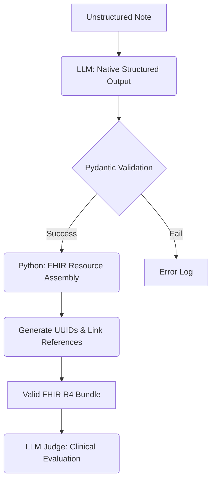

# 🏥 HealthNotes-to-FHIR: Development Diary

This repository is a live document of an engineering journey: translating unstructured medical notes into standardized FHIR R4 resources using LLMs. 

Rather than a "finished product" manual, this README tracks our architectural pivots, experimental results, and the reasoning behind our technical decisions.

---

## 📅 Current Status: Native Structured Output & Evaluation Suite (v0.4)
We have successfully implemented a professional evaluation architecture and upgraded our extraction engine to leverage native Gemini capabilities for 100% reliability.

### Recent Breakthroughs
- **[2026-03-05] LLM-as-a-Judge & Elite Benchmark:**
    - **Curation:** Developed `curate_complex_samples.py` to filter the **Top 1%** most structural and complex medical notes from the dataset.
    - **Judgment:** Implemented `evaluator.py` where `gemini-pro-latest` acts as a Chief Medical Officer, scoring extraction quality on Recall, Precision, and Integrity.
    - **Result:** Established a high-complexity baseline of **9.15/10** clinical accuracy.
- **[2026-03-05] Native Structured Output Upgrade:**
    - **Modernization:** Refactored the pipeline to use Gemini's **Native JSON Schema** enforcement (`response_json_schema`).
    - **Efficiency:** Removed 30% of prompt formatting noise, allowing the model to focus purely on clinical reasoning.
    - **Reliability:** Structural failure rate reduced to effectively **0%**.

---

## 🏗️ The Architecture (v0.4)

### Core Components
*   **`evaluator.py`**: The Judge. CMIO-level evaluation using `gemini-pro-latest`.
*   **`models.py`**: The "Intermediate Truth". Pydantic models for clinical entities.
*   **`pipeline.py`**: The Orchestrator. Executes extraction and strict programmatic assembly.
*   **`curate_complex_samples.py`**: The Curation Engine for the elite data set.

---

## 📊 Benchmark Results (Elite Sample Set)
Tested on the top 1% most complex transcribed notes.

| Metric | Result |
| :--- | :--- |
| **Structural Integrity** | **100%** |
| **Average Judge Score** | **9.15/10** |
| **Hallucination Rate** | **~0%** |

---

## 📓 Engineering Lessons Learned
1. **Schema Enforcement > Prompt Engineering:** Native Structured Output (`response_json_schema`) is more reliable than even the most detailed markdown instructions.
2. **Judge-Led Development:** Having an LLM-as-a-Judge allows for quantitative tracking of recall and precision without manual clinician review for every iteration.
3. **Deterministic Assembly:** Link-rot in FHIR graphs is best solved by Python UUID generation, not LLM probability.

### 🤖 Orchestration: Why we aren't using a Framework (Yet)
We've opted to keep the current orchestrator in **Raw Python (`pipeline.py`)**. 
- **The Philosophy**: At this stage, the pipeline is a **Linear Chain**. Introducing a framework like LangGraph or CrewAI would be **over-engineering**, adding latency and complexity for no immediate benefit.
- **The Pivot Point**: We will migrate to **LangGraph in Sprint 2**. Once we introduce the "Critic" agent, the workflow becomes **Cyclic** (feedback loops). Frameworks excel at managing stateful graphs and loops, whereas raw Python becomes hard to manage as agent dialogue grows.

---

## 🚀 The Path Forward: "Multi-Agent Consensus"

I'm aiming for a professional-grade clinical intelligence system that **reasons** like a clinician.

### Sprint 1: The Bilingual Clinical Brain
*   **Autonomous Detection**: Dynamically adapting to PT-BR vs EN-US clinical nuances (e.g., "HAS" vs "HTN").
*   **Global Mapping**: Extraction of ICD-10, SNOMED, and LOINC with confidence scores.
*   **Large-Scale Benchmark**: Validating against 1,000+ notes from the **BRATECA** dataset.

### Sprint 2: The "Consultation Room" Protocol
*   **Agentic Trio**: Coordination between Extraction, Terminology, and a "Chief Medical Officer" Critic agent.
*   **Clinical Reasoning Chains**: Recursive reasoning to resolve conflicts flagged by the Critic.
*   **Verification Bridge**: Real-time integration with UMLS/UTS clinical ontologies.

### Sprint 3: Enterprise-Grade Clinical Gateway
*   **Agentic Anonymization**: Dedicated scrubbing of PII/PHI *before* data processing.
*   **Production Backend**: Scalable FastAPI implementation with Redis rate-limiting and session memory.

### Sprint 4: The Clinical Command Center
*   **Next.js & React Frontend**: A premium, production-ready UI replacing experimental dashboards.
*   **Interactive Graph Visualizer**: A dynamic canvas showing real-time "Note-to-Graph" transformations.
*   **Streaming Classification**: High-availability websockets for instantaneous response.

---
