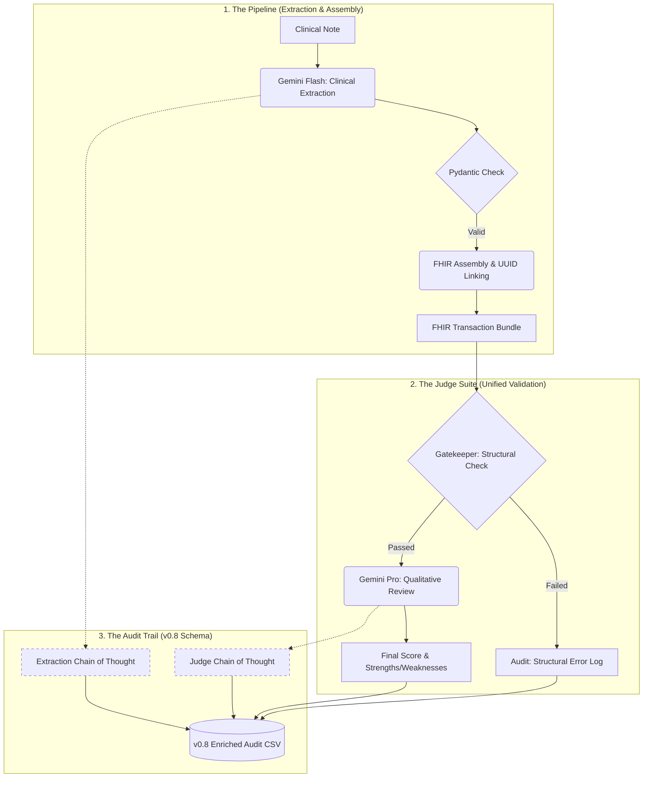

# 🏥 HealthNotes-to-FHIR: Development Diary

This repository is a live document of an engineering journey: translating unstructured medical notes into standardized FHIR R4 resources using LLMs. 

Rather than a "finished product" manual, this README tracks our architectural pivots, experimental results, and the reasoning behind our technical decisions.

---

## 📅 Current Status: Professional Experimentation & Deep Auditing (v0.5)
We have transitioned from a single-threaded extraction tool into a multi-threaded, self-auditing clinical engine. The system now captures not just the *output*, but the *reasoning* behind every clinical decision.

### Recent Breakthroughs
- **[2026-03-05] Parallel Execution & Scalability:**
    - **Performance:** Implemented multi-threaded processing (`ThreadPoolExecutor`) allowing for 2x faster results on large datasets.
    - **CLI Control:** Added arguments for flexible testing (`--n <count>` and `--parallel` flags).
    - **Thread Safety:** Integrated `threading.Lock` to ensure data integrity during high-concurrency 
- **[2026-03-05] The "Deep Audit" (Explainability):**
    - **Transparency:** Now capturing the `thought_signature` (Chain of Thought) from both the Extraction and Judging models.
    - **Forensics:** Reasoning is base64-encoded and stored in the `audit_log.csv` (v0.8), allowing clinicians to audit *why* the AI assigned a specific code or score.
- **[2026-03-05] Unified Evaluation Engine:**
    - **Consolidation:** Merged deterministic structural valiation into the LLM-as-a-Judge suite.
    - **Precision:** The Judge now performs a "Gatekeeper" check for FHIR structural integrity before proceeding to clinical qualitative analysis.

---

## 🏗️ The Engineering Architecture (v0.5)

### Core Components
*   **`evaluator.py`**: The Judge. Now a unified engine performing both deterministic structural validation and CMIO-level clinical review.
*   **`pipeline.py`**: The Orchestrator. Handles structured extraction with reasoning capture and strict FHIR assembly.
*   **`run_experiment.py`**: The High-Performance Runner. Supports parallel processing, CLI arguments, and thread-safe logging.
*   **`models.py`**: The Schema Truth. Defines Pydantic models for both clinical data and judge evaluations.

---

## 📊 Benchmark Results (Elite Sample Set)
Tested on the top 1% most complex transcribed notes.

| Metric | Result |
| :--- | :--- |
| **Structural Integrity** | **100%** |
| **Average Judge Score** | **9.15/10** |
| **Concurrency Support** | **2 parallel threads** |
| **Audit Depth** | **Full reasoning signatures captured** |

---

## 🚀 The Path Forward: Clinical Intelligence Roadmap

### Sprint 1: Audit & Reflection
*   **Deep Reasoning Analysis**: Systematically analyze the captured `thought_signature` and judging logs to understand extraction failures and patterns.
*   **Recursive Improvement**: Use these findings to refine prompts and logical assembly rules for higher clinical accuracy.

### Sprint 2: The Bilingual Brain (Portuguese Expansion)
*   **PT-BR Adaptation**: Calibrating prompts to handle Brazilian clinical nuances and datasets (e.g., **BRATECA** and **SemClinBr**).
*   **Multilingual Extraction**: Ensuring 100% reliability for both EN-US and PT-BR transcripts using the same unified pipeline.

### Sprint 3: Integration & Evidence
*   **Real Terminology APIs**: Transition from standalone LLM extraction to live API consumption (e.g., NIH UMLS/VSAC) to verify and ground clinical codes.
*   **Agentic Conflict Resolver**: Implementing a dedicated agent responsible for **Contradiction Detection**, cross-referencing extracted FHIR findings with the source text to surface clinical discrepancies.

### Sprint 4: Security & Privacy
*   **PII/PHI Scrubbing**: Implement local de-identification using **Microsoft Presidio** to ensure sensitive clinical data is scrubbed before processing (supporting multi-language entities).

### Sprint 5: Professional Infrastructure
*   **Enterprise API**: Deploy the pipeline as a production-grade **FastAPI** service.
*   **Traffic Management**: Implement strict rate limits and session management to ensure system stability and cost control.

### Sprint 6: Unified User Interface
*   **Professional UI**: Build a clean, intuitive frontend connected to the API for easy testing and demonstration.
*   **Voice Clinical Intake**: Integrate **OpenAI Whisper** so users can input clinical notes directly via audio dictation (supporting multiple languages).

---

*Disclaimer: This is an experimental research project. Do not use for actual PHI or clinical decision-making.*